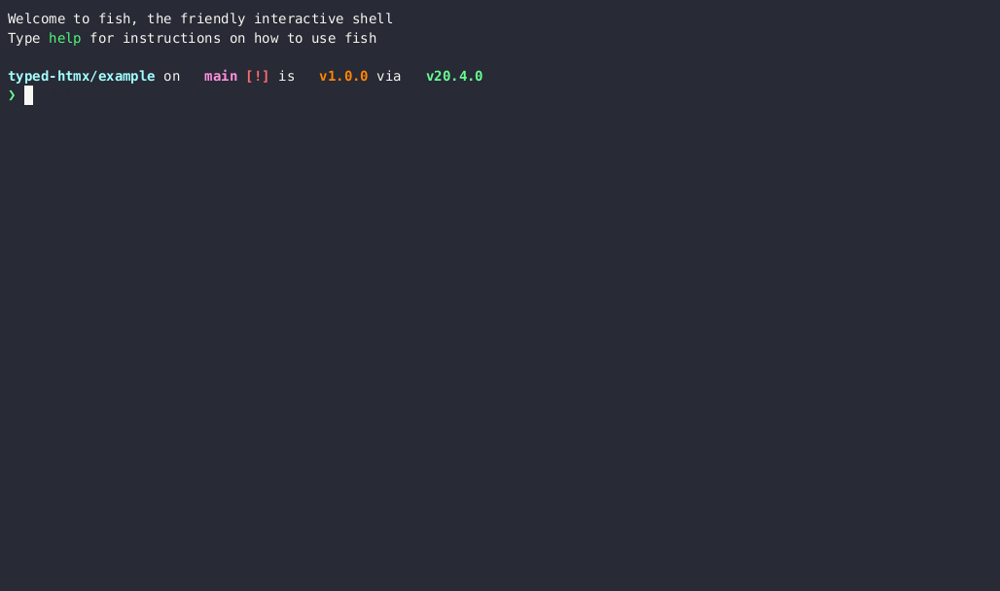

# typed-htmx

[](https://www.npmjs.com/package/typed-htmx)
[](https://github.com/Desdaemon/typed-htmx/actions/workflows/docs.yml)

[](https://asciinema.org/a/598553)

Definitions for htmx attributes in JSX.

## Usage

You can configure `typed-htmx` either as pure type declarations, or as a JSX
templating engine.

### As type declarations

Configure your `tsconfig.json` as follows:

```json
{
  "compilerOptions": {
    "jsx": "react",
    "moduleResolution": "node16", // or "nodenext"
    "types": ["typed-htmx" /** and any other types you need */]
  }
}
```

An alternative is to include a _[triple-slash directive]_ wherever you need
completions for htmx attributes:

```jsx
/// <reference types="typed-htmx" />

function MyComponent({ children }) {
  return <div hx-get="/asd">{children}</div>;
  //          ^?: string | undefined
}
```

### As a JSX templating engine

If you prefer to use JSX only for its templating capabilities in the vein of
[typed-html], you can use `typed-htmx/typed-html` which is included with this
library and optimized for htmx usage:

- Attributes such as [`hx-vals`] and [`hx-headers`] may also accept an object
  literal, which will be stringified on demand.
- Configurable options for sanitization, defaults to a no-op.

Configure your `tsconfig.json` as follows:

```json
{
  "compilerOptions": {
    "jsx": "react-jsx",
    "jsxImportSource": "typed-htmx/typed-html",
    "moduleResolution": "node16" // or "nodenext"
  }
}
```

[`hx-vals`]: https://htmx.org/attributes/hx-vals/
[`hx-headers`]: https://htmx.org/attributes/hx-headers/
[typed-html]: https://github.com/nicojs/typed-html
[triple-slash directive]: https://www.typescriptlang.org/docs/handbook/triple-slash-directives.html
